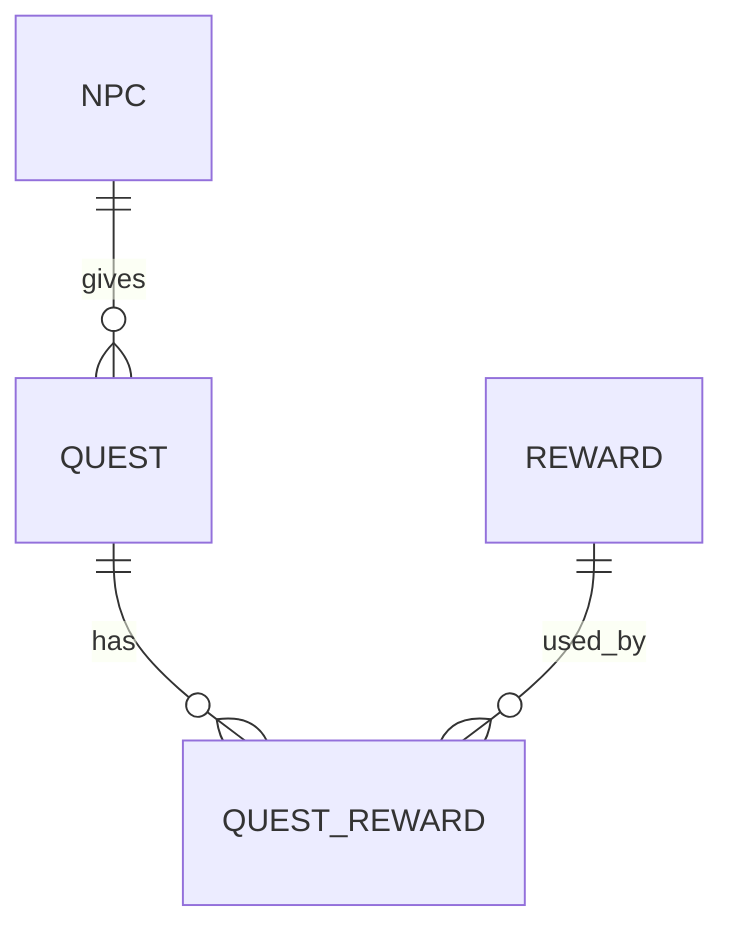
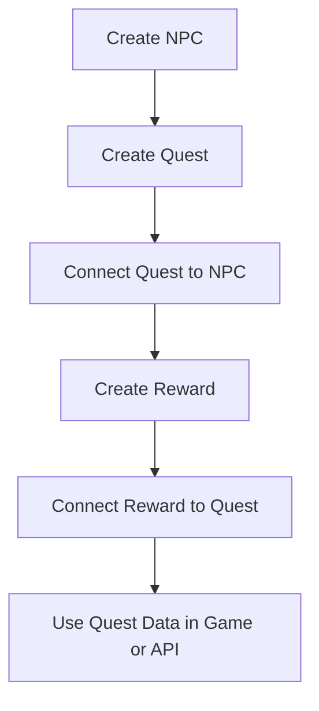

# NPC / Quest / Reward 데이터 모델 설계

## 1. 목적

Quest Manager 프로젝트에서 사용하는 핵심 데이터 모델을 정의한다.

이 문서는 Unity 게임에서 사용하던 퀘스트 시스템 구조를 웹 관리 시스템 관점으로 재설계하기 위한 문서이다.
관리자는 웹에서 NPC, Quest, Reward 데이터를 생성하고 수정할 수 있으며, 이후 이 데이터를 게임 또는 API에서 활용할 수 있도록 한다.

---

## 2. 핵심 도메인

Quest Manager의 핵심 도메인은 다음 세 가지이다.

| 도메인    | 설명                 |
| ------ | ------------------ |
| NPC    | 퀘스트를 제공하는 캐릭터      |
| Quest  | NPC가 제공하는 임무 또는 요청 |
| Reward | 퀘스트 완료 시 지급되는 보상   |

---

## 3. 기본 관계

초기 설계에서는 다음과 같은 관계를 기준으로 한다.



### 관계 설명

* 하나의 NPC는 여러 개의 Quest를 가질 수 있다.
* 하나의 Quest는 여러 개의 Reward를 가질 수 있다.
* 하나의 Reward는 여러 Quest에서 재사용될 수 있다.
* Quest와 Reward는 다대다 관계가 될 수 있으므로 `QuestReward` 중간 테이블을 둔다.

---

## 4. NPC 모델

NPC는 퀘스트를 제공하는 캐릭터 데이터이다.

| 필드명         | 타입       | 설명          |
| ----------- | -------- | ----------- |
| id          | number   | NPC 고유 ID   |
| name        | string   | NPC 이름      |
| description | string   | NPC 설명      |
| role        | string   | NPC 역할      |
| location    | string   | NPC가 위치한 장소 |
| imageUrl    | string   | NPC 이미지 경로  |
| isActive    | boolean  | 사용 여부       |
| createdAt   | datetime | 생성일         |
| updatedAt   | datetime | 수정일         |

### 예시 데이터

```json
{
  "id": 1,
  "name": "마을 경비병",
  "description": "마을 입구를 지키는 경비병이다.",
  "role": "QUEST_GIVER",
  "location": "Village Entrance",
  "imageUrl": "/images/npcs/guard.png",
  "isActive": true,
  "createdAt": "2026-07-01T10:00:00",
  "updatedAt": "2026-07-01T10:00:00"
}
```

---

## 5. Quest 모델

Quest는 플레이어가 수행해야 하는 임무 데이터이다.

| 필드명           | 타입       | 설명               |
| ------------- | -------- | ---------------- |
| id            | number   | Quest 고유 ID      |
| npcId         | number   | 퀘스트를 제공하는 NPC ID |
| title         | string   | 퀘스트 제목           |
| description   | string   | 퀘스트 설명           |
| objective     | string   | 퀘스트 목표           |
| type          | string   | 퀘스트 유형           |
| status        | string   | 퀘스트 상태           |
| requiredLevel | number   | 요구 레벨            |
| isRepeatable  | boolean  | 반복 가능 여부         |
| createdAt     | datetime | 생성일              |
| updatedAt     | datetime | 수정일              |

### Quest Type 예시

| 값        | 설명      |
| -------- | ------- |
| TALK     | NPC와 대화 |
| COLLECT  | 아이템 수집  |
| KILL     | 몬스터 처치  |
| DELIVERY | 전달      |
| DAILY    | 일일 퀘스트  |

### Quest Status 예시

| 값        | 설명   |
| -------- | ---- |
| DRAFT    | 작성 중 |
| ACTIVE   | 사용 중 |
| INACTIVE | 비활성화 |
| ARCHIVED | 보관됨  |

### 예시 데이터

```json
{
  "id": 1,
  "npcId": 1,
  "title": "마을 주변 정리",
  "description": "마을 주변에 나타난 슬라임을 처치해 주세요.",
  "objective": "슬라임 5마리 처치",
  "type": "KILL",
  "status": "ACTIVE",
  "requiredLevel": 1,
  "isRepeatable": false,
  "createdAt": "2026-07-01T10:00:00",
  "updatedAt": "2026-07-01T10:00:00"
}
```

---

## 6. Reward 모델

Reward는 퀘스트 완료 시 지급되는 보상 데이터이다.

| 필드명         | 타입       | 설명           |
| ----------- | -------- | ------------ |
| id          | number   | Reward 고유 ID |
| name        | string   | 보상 이름        |
| type        | string   | 보상 유형        |
| value       | number   | 보상 수량 또는 값   |
| description | string   | 보상 설명        |
| iconUrl     | string   | 보상 아이콘 경로    |
| createdAt   | datetime | 생성일          |
| updatedAt   | datetime | 수정일          |

### Reward Type 예시

| 값      | 설명    |
| ------ | ----- |
| GOLD   | 골드    |
| EXP    | 경험치   |
| ITEM   | 아이템   |
| STAT   | 능력치   |
| CUSTOM | 기타 보상 |

### 예시 데이터

```json
{
  "id": 1,
  "name": "골드",
  "type": "GOLD",
  "value": 500,
  "description": "퀘스트 완료 보상으로 지급되는 골드",
  "iconUrl": "/images/rewards/gold.png",
  "createdAt": "2026-07-01T10:00:00",
  "updatedAt": "2026-07-01T10:00:00"
}
```

---

## 7. QuestReward 모델

Quest와 Reward는 다대다 관계를 가질 수 있으므로 중간 모델을 사용한다.

예를 들어 하나의 퀘스트가 골드와 경험치를 동시에 지급할 수 있고, 같은 골드 보상 데이터가 여러 퀘스트에서 재사용될 수도 있다.

| 필드명       | 타입       | 설명                |
| --------- | -------- | ----------------- |
| id        | number   | QuestReward 고유 ID |
| questId   | number   | Quest ID          |
| rewardId  | number   | Reward ID         |
| amount    | number   | 지급 수량             |
| createdAt | datetime | 생성일               |
| updatedAt | datetime | 수정일               |

### 예시 데이터

```json
{
  "id": 1,
  "questId": 1,
  "rewardId": 1,
  "amount": 500,
  "createdAt": "2026-07-01T10:00:00",
  "updatedAt": "2026-07-01T10:00:00"
}
```

---

## 8. 전체 데이터 흐름

관리자가 웹에서 NPC를 생성한다.

그 다음 해당 NPC에게 Quest를 연결한다.

Quest에는 완료 조건과 보상을 설정한다.

플레이어가 게임에서 Quest를 완료하면 연결된 Reward 정보를 기준으로 보상을 지급한다.



---

## 9. MVP 기준 데이터 모델

초기 버전에서는 다음 모델을 우선 구현한다.

| 모델          | 우선순위 | 설명               |
| ----------- | ---- | ---------------- |
| NPC         | 필수   | 퀘스트 제공자          |
| Quest       | 필수   | 퀘스트 본문           |
| Reward      | 필수   | 보상 정보            |
| QuestReward | 필수   | Quest와 Reward 연결 |

추후 확장 가능한 모델은 다음과 같다.

| 모델             | 설명                       |
| -------------- | ------------------------ |
| QuestObjective | 복잡한 퀘스트 목표를 여러 개로 나누는 모델 |
| QuestCondition | 퀘스트 수락 조건 모델             |
| PlayerQuest    | 플레이어별 퀘스트 진행 상태 모델       |
| Dialogue       | NPC 대화 데이터 모델            |

---

## 10. 설계 결정

### Reward를 Quest 내부 필드로 넣지 않는 이유

Quest 안에 `gold`, `exp`, `item` 같은 필드를 직접 넣으면 초기 구현은 간단하지만, 보상 구조가 복잡해질수록 확장하기 어렵다.

따라서 Reward를 별도 모델로 분리하고, QuestReward를 통해 Quest와 Reward를 연결한다.

이 구조를 사용하면 다음 장점이 있다.

* 하나의 Quest에 여러 보상을 연결할 수 있다.
* 같은 Reward를 여러 Quest에서 재사용할 수 있다.
* 보상 유형이 늘어나도 Quest 모델을 크게 수정하지 않아도 된다.

---

## 11. 추후 고려사항

현재 문서는 MVP 기준의 기본 데이터 모델만 정의한다.

추후에는 다음 기능을 고려할 수 있다.

* AI를 이용한 Quest 자동 생성
* NPC 성격 기반 Quest 추천
* 보상 밸런스 자동 계산
* 플레이어별 Quest 진행 상태 저장
* Unity 클라이언트와 API 연동
* 관리자 페이지에서 NPC / Quest / Reward CRUD 구현
