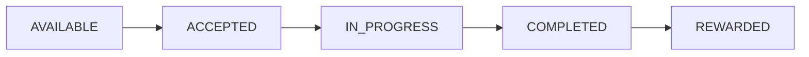
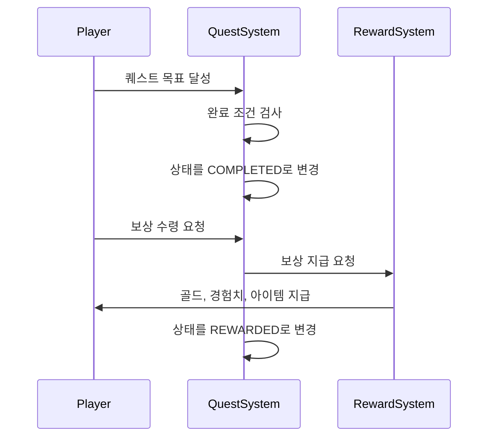

# Quest 상태 흐름 설계

## 1. 목적

Quest Manager 프로젝트에서 퀘스트가 생성되고, 플레이어에게 노출되고, 수락되고, 완료되고, 보상이 지급되기까지의 상태 흐름을 정의한다.

이 문서는 플레이어 기준의 퀘스트 진행 상태를 설계하기 위한 문서이다.

---

## 2. 상태 흐름 개요

퀘스트 진행 상태는 플레이어가 특정 퀘스트와 어떤 관계에 있는지를 나타낸다.

예를 들어 같은 퀘스트라도 플레이어 A는 이미 완료했을 수 있고, 플레이어 B는 아직 수락하지 않았을 수 있다.
따라서 퀘스트 진행 상태는 Quest 데이터 자체가 아니라, 플레이어별 Quest 진행 데이터에서 관리하는 것이 자연스럽다.



---

## 3. 상태 목록

| 상태          | 설명                     |
| ----------- | ---------------------- |
| AVAILABLE   | 플레이어가 수락할 수 있는 상태      |
| ACCEPTED    | 플레이어가 퀘스트를 수락한 상태      |
| IN_PROGRESS | 플레이어가 퀘스트 목표를 진행 중인 상태 |
| COMPLETED   | 퀘스트 완료 조건을 달성한 상태      |
| REWARDED    | 보상 지급까지 완료된 상태         |

---

## 4. 상태별 상세 설명

### AVAILABLE

퀘스트가 플레이어에게 노출되고, 수락할 수 있는 상태이다.

이 상태가 되기 위한 조건은 다음과 같다.

* Quest 운영 상태가 `ACTIVE`이다.
* 플레이어가 퀘스트 수락 조건을 만족한다.
* 선행 퀘스트 조건이 있다면 완료되어 있다.
* 반복 퀘스트라면 다시 수락 가능한 시간이 되었다.

예시:

```json
{
  "questId": 1,
  "playerId": 10,
  "status": "AVAILABLE"
}
```

---

### ACCEPTED

플레이어가 퀘스트를 수락한 상태이다.

이 상태에서는 아직 목표 진행이 시작되지 않았을 수도 있다.
예를 들어 NPC에게 퀘스트를 수락했지만, 아직 몬스터를 처치하거나 아이템을 수집하지 않은 상태이다.

상태 변경 조건:

```text
AVAILABLE → ACCEPTED
```

변경 조건:

* 플레이어가 퀘스트 수락 버튼을 누른다.
* 서버 또는 시스템이 수락 가능 여부를 확인한다.
* 조건을 만족하면 퀘스트 상태가 `ACCEPTED`로 변경된다.

---

### IN_PROGRESS

플레이어가 퀘스트 목표를 실제로 진행 중인 상태이다.

예를 들어 다음과 같은 상황에서 `IN_PROGRESS`가 된다.

* 몬스터 처치 수가 1 이상 증가했다.
* 아이템 수집 수가 1 이상 증가했다.
* 특정 장소에 도착했다.
* 특정 NPC와 대화를 진행했다.

상태 변경 조건:

```text
ACCEPTED → IN_PROGRESS
```

변경 조건:

* 퀘스트 목표 진행도가 처음으로 갱신된다.

예시:

```json
{
  "questId": 1,
  "playerId": 10,
  "status": "IN_PROGRESS",
  "currentCount": 2,
  "requiredCount": 5
}
```

---

### COMPLETED

퀘스트 완료 조건을 모두 만족한 상태이다.

이 상태는 목표는 달성했지만, 아직 보상을 받지는 않은 상태이다.

상태 변경 조건:

```text
IN_PROGRESS → COMPLETED
```

변경 조건:

* 필요한 몬스터 처치 수를 모두 채웠다.
* 필요한 아이템을 모두 수집했다.
* 필요한 대화 또는 이벤트를 완료했다.
* 모든 Objective가 완료되었다.

예시:

```json
{
  "questId": 1,
  "playerId": 10,
  "status": "COMPLETED",
  "currentCount": 5,
  "requiredCount": 5
}
```

---

### REWARDED

퀘스트 완료 후 보상 지급까지 끝난 상태이다.

이 상태가 되면 같은 퀘스트의 보상을 중복으로 받을 수 없어야 한다.

상태 변경 조건:

```text
COMPLETED → REWARDED
```

변경 조건:

* 플레이어가 보상 받기 버튼을 누른다.
* 시스템이 퀘스트 완료 상태를 확인한다.
* Reward 정보를 기준으로 보상을 지급한다.
* 보상 지급이 성공하면 상태를 `REWARDED`로 변경한다.

예시:

```json
{
  "questId": 1,
  "playerId": 10,
  "status": "REWARDED",
  "rewardedAt": "2026-07-02T10:00:00"
}
```

---

## 5. 완료 및 보상 지급 흐름

퀘스트 완료와 보상 지급은 분리해서 처리한다.



완료 상태와 보상 지급 상태를 분리하는 이유는 다음과 같다.

* 퀘스트 완료와 보상 수령 시점을 다르게 처리할 수 있다.
* 보상 지급 실패 상황을 처리할 수 있다.
* 중복 보상 지급을 방지할 수 있다.
* 플레이어가 완료한 퀘스트 목록과 보상 수령 여부를 구분할 수 있다.

---

## 6. 상태 변경 규칙

| 현재 상태       | 다음 상태       | 변경 조건            |
| ----------- | ----------- | ---------------- |
| AVAILABLE   | ACCEPTED    | 플레이어가 퀘스트를 수락한다  |
| ACCEPTED    | IN_PROGRESS | 퀘스트 목표 진행도가 갱신된다 |
| IN_PROGRESS | COMPLETED   | 완료 조건을 모두 만족한다   |
| COMPLETED   | REWARDED    | 보상 지급이 완료된다      |

---

## 7. 예외 상황

### 퀘스트 포기

추후 기능으로 플레이어가 퀘스트를 포기할 수 있다면 `CANCELED` 또는 `ABANDONED` 상태를 추가할 수 있다.

```text
ACCEPTED → ABANDONED
IN_PROGRESS → ABANDONED
```

MVP에서는 퀘스트 포기 기능을 제외한다.

---

### 반복 퀘스트

반복 퀘스트의 경우 `REWARDED` 이후 다시 `AVAILABLE` 상태가 될 수 있다.

```text
REWARDED → AVAILABLE
```

단, 이 경우에는 반복 가능 시간 또는 일일 초기화 조건이 필요하다.

예시:

* 매일 오전 5시에 초기화
* 24시간 후 재수락 가능
* 주간 퀘스트는 매주 월요일 초기화

---

### 즉시 완료 퀘스트

대화 퀘스트처럼 수락과 동시에 완료되는 퀘스트는 일부 상태를 건너뛸 수 있다.

```text
AVAILABLE → ACCEPTED → COMPLETED → REWARDED
```

예를 들어 NPC와 대화만 하면 완료되는 퀘스트는 `IN_PROGRESS` 상태가 짧거나 생략될 수 있다.

---

## 8. PlayerQuest 모델 초안

퀘스트 진행 상태는 플레이어별로 달라질 수 있으므로 별도 모델로 관리한다.

| 필드명           | 타입       | 설명                |
| ------------- | -------- | ----------------- |
| id            | number   | PlayerQuest 고유 ID |
| playerId      | number   | 플레이어 ID           |
| questId       | number   | Quest ID          |
| status        | string   | 퀘스트 진행 상태         |
| currentCount  | number   | 현재 진행 수치          |
| requiredCount | number   | 목표 수치             |
| acceptedAt    | datetime | 수락 시간             |
| completedAt   | datetime | 완료 시간             |
| rewardedAt    | datetime | 보상 수령 시간          |
| createdAt     | datetime | 생성일               |
| updatedAt     | datetime | 수정일               |

예시 데이터:

```json
{
  "id": 1,
  "playerId": 10,
  "questId": 1,
  "status": "IN_PROGRESS",
  "currentCount": 2,
  "requiredCount": 5,
  "acceptedAt": "2026-07-02T09:00:00",
  "completedAt": null,
  "rewardedAt": null,
  "createdAt": "2026-07-02T09:00:00",
  "updatedAt": "2026-07-02T09:10:00"
}
```

---

## 9. MVP 기준

MVP에서는 다음 상태만 우선 사용한다.

| 상태          | 사용 여부 |
| ----------- | ----- |
| AVAILABLE   | 사용    |
| ACCEPTED    | 사용    |
| IN_PROGRESS | 사용    |
| COMPLETED   | 사용    |
| REWARDED    | 사용    |
| ABANDONED   | 추후 고려 |
| FAILED      | 추후 고려 |

초기 버전에서는 퀘스트 포기, 실패, 시간 제한 기능은 제외한다.

---

## 10. 설계 결정

### CREATED를 제외한 이유

`CREATED`는 퀘스트 데이터가 생성되었다는 의미에 가깝다.

하지만 이 문서에서 다루는 상태는 플레이어별 퀘스트 진행 상태이므로, `CREATED`보다는 `AVAILABLE`부터 시작하는 것이 더 자연스럽다.

관리자가 퀘스트를 생성했지만 아직 게임에서 사용하지 않는 상태는 Quest 운영 상태의 `DRAFT` 또는 `INACTIVE`로 관리한다.

---

### COMPLETED와 REWARDED를 분리한 이유

퀘스트 목표를 완료한 것과 보상을 받은 것은 서로 다른 사건이다.

두 상태를 분리하면 다음과 같은 장점이 있다.

* 보상을 아직 받지 않은 완료 퀘스트를 표시할 수 있다.
* 보상 중복 지급을 방지할 수 있다.
* 보상 지급 실패 시 재처리할 수 있다.
* 완료 기록과 보상 수령 기록을 따로 관리할 수 있다.
